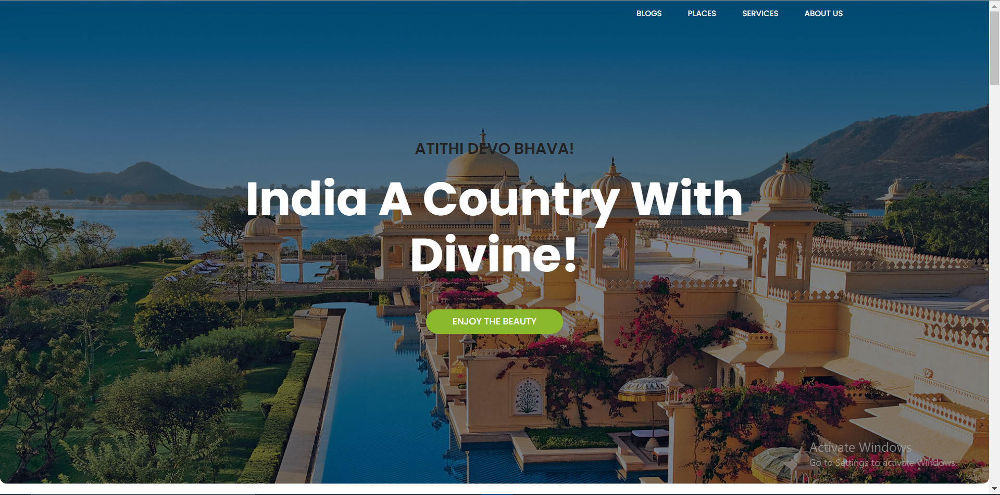
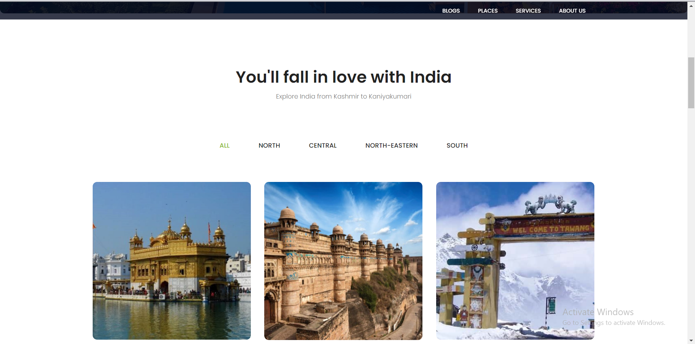

	
	<h4>A simple Tourism Website page which shows travel destinations across various part of Country. This theme is made using Bootstrap features several content sections, a responsive portfolio grid (tourist-places), window modals for each portfolio item, Blogs section and AboutUs Section</h4>

## [Live Preview]

	<h4>Tour India Preview</h4>
	

	<h4>Glimpse Preview</h4>
	

## Wireframe

	<h4>Tour India Wireframe</h4>
	

## Usage
After downloading, simply edit the HTML and CSS files included with the template in a code editor to make changes. These are the only files you need to worry about, you can ignore everything else! To preview the changes you make to the code, you can open the `index.html` file in your web browser.
